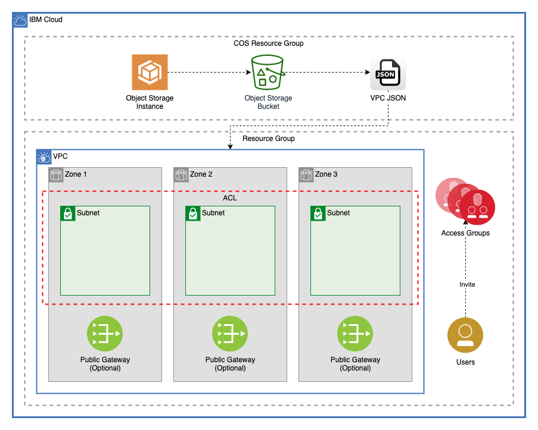

# Multi-tier landing zone with IAM and resource group access for a catalog offering

This module creates a resource group, a VPC in that resource group, IAM Access Groups, and invites users to those Access Groups. This module configures the environment by using a JSON Object stored in Cloud Object Storage to allow users to configure and update complex environments as part of a catalog offering. 



---

## Table of Contents

1. [Prerequisites](##Prerequisites)
2. [Cloud Object Storage](##cloud-object-storage)
3. [Access Groups](##access-groups)
4. [VPC](##vpc)
5. [Public Gateways](##public-gateways)
6. [Network ACL](##network-acl)
7. [Subnets](##subnets)
8. [Module Variables](##Module-Variables)
9. [Module Outputs](##Module-Outputs)
10. [As A Module in a Larger Architecture](##As-A-Module-in-a-Larger-Architecture)

---

## Prerequisites

This module requires a Cloud Object Storage instance with a regional bucket. To use `upload.sh`, the IBM Cloud CLI with the resource and cos plugins installed.

---

## Cloud Object Storage

Currently there is a limitation within the IBM Cloud Catalog that prevents Schematics Templates from using variables other than `string`, `number`, and `boolean`. This module uses [upload.sh](./upload.sh) to upload a configuration variable to a Cloud Object Storage bucket. This object can then be retrieved by a schematics workspace, allowing users to manage complex variables in their environment.

### JSON Object

The JSON Object uploaded uses the variables in [/landing_zone/variables.tf](./landing_zone/variables.tf) to create the VPC, access groups, ACL Rules, and Security Group Rules by converting them to JSON notation. By nesting this module, it allows for variable validation to be performed.

An example JSON Object can be found in [vpc-example.json](vpc-example.json)

```json
{
    "access_groups" : [
        {
            "name" : "support",
            "description" : "An example access group",
            "policies" : [
                {
                    "name" : "support_test",
                    "resources" : {
                        "service" : "support"
                    },
                    "roles" : ["Editor"]
                }
            ],
            "dynamic_policies": []
        }
    ],
    "use_public_gateways" : {
        "zone-1" : true,
        "zone-2" : true,
        "zone-3" : true
    },
    "subnets" : {
        "zone-1" : [
            {
              "name" : "subnet-a",
              "cidr" : "10.10.10.0/24",
              "public_gateway" : true
            }
        ],
        "zone-2" : [
            {
                "name" : "subnet-b",
                "cidr" : "10.20.10.0/24",
                "public_gateway" : true
            }
        ],
        "zone-3" : [
            {
                "name" : "subnet-c",
                "cidr" : "10.30.10.0/24",
                "public_gateway" : true
            }
        ]
    },
    "acl_rules" : [
        {
            "name" : "allow-all-inbound",
            "action" : "allow",
            "direction" : "inbound",
            "destination" : "0.0.0.0/0",
            "source" : "0.0.0.0/0"
        },
        {
            "name" : "allow-all-outbound",
            "action" : "allow",
            "direction" : "outbound",
            "destination" : "0.0.0.0/0",
            "source" : "0.0.0.0/0"
        }
    ],
    "security_group_rules" : [
        {
            "name" : "allow-inbound-ping",
            "direction" : "inbound",
            "remote" : "0.0.0.0/0",
            "icmp" : {
                "type" : 8
            }
        },
        {
            "name" : "allow-inbound-ssh",
            "direction" : "inbound",
            "remote" : "0.0.0.0/0",
            "tcp" : {
                "port_min" : 22,
                "port_max" : 22
            }
        }
    ]
}
```

### Uploading the Object

Using [upload.sh](./upload.sh) allows users to create and update JSON objects in Cloud Object Storage.

```bash
sh ./upload.sh <cos instance name> <cos bucket name> <object name> <file path>
```

### Automatically Update Schematics Workspace

Optionally a fifth parameter can be passed to [upload.sh](./upload.sh), the name of the schematics workspace created by a catalog entry. This will force an `apply` action to run in that workspace after a new object has been uploaded to COS.

---

## Access Groups

The [iam](./iam) module creates any number of access groups, with any number of policies.

The flexible `access_groups` variable allows users to dynamically create groups with complex rules using a single object.

### Invite Users

Users can be invited to these groups. Users invited to these access groups will be added to the access group even if they have not yet accepted the invite to the account. (If you do not need to invite users, delete [./iam/invite_users.tf](./iam/invite_users.tf) and remove `invite_users` fom the `access_group` variable definition.)

### Varable Type

```hcl
    list(
        object({
            name        = string # Name of the group
            description = string # Description of group
            policies    = list(
                object({
                    name      = string       # Name of the policy
                    roles     = list(string) # list of roles for the policy
                    resources = object({
                        resource_group       = optional(string) # Name of the resource group the policy will apply to
                        resource_type        = optional(string) # Name of the resource type for the policy ex. "resource-group"
                        service              = optional(string) # Name of the service type for the policy ex. "cloud-object-storage"
                        resource_instance_id = optional(string) # ID of a service instance to give permissions
                    })
                })
            )
            dynamic_policies = optional(
                list(
                    object({
                        name              = string # Dynamic group name
                        identity_provider = string # URI for identity provider
                        expiration        = number # How many hours authenticated users can work before refresh
                        conditions        = object({
                                claim    = string # key value to evaluate the condition against.
                                operator = string # The operation to perform on the claim. Supported values are EQUALS, EQUALS_IGNORE_CASE, IN, NOT_EQUALS_IGNORE_CASE, NOT_EQUALS, and CONTAINS.
                                value    = string # Value to be compared agains
                        })
                    })
                )
            )
            account_management_policies = optional(list(string)) # A list of group access management roles to create.
            invite_users                = list(string)           # Users to invite to the access group
        })
    )
```

---

## VPC

This module creates a VPC in a resource group with optional Classic Access. It also allows users to update the default vpc security group with additional rules.

### Default Security Group Rules

Default security group rules are converted from a list to an object to ensure that adding, deleting, or changing the order of rules listed will not force unwanted changes. Example:

```terraform
ibm_is_security_group_rule.default_vpc_rule["allow-inbound-ping"]
ibm_is_security_group_rule.default_vpc_rule["allow-inbound-ssh"]
```

---

## Public Gateways

This module allows a user to optionally create public gateways in the VPC in each of the three zones of the VPC's region.

---

## Network ACL

This module creates a network ACL with any number of rules. *(Note: by default, VPC Network ACLs have a maximum of 25 rules.)*
Any subnets created by this module will be connected to this ACL

## Subnets

The [subnet module](./subnet) allows users to create subnets in 1, 2, or 3 zones. Public gateways can be optionally attached to each subnet.

### Address Prefixes

A CIDR block is created in the VPC for each subnet that will be provisioned

### Subnets

The type of the `subnets` variable is as follows:

```terraform
object({
    zone-1 = list(object({
      name           = string
      cidr           = string
      public_gateway = optional(bool)
    }))
    zone-2 = list(object({
      name           = string
      cidr           = string
      public_gateway = optional(bool)
    }))
    zone-3 = list(object({
      name           = string
      cidr           = string
      public_gateway = optional(bool)
    }))
  })
```

While `zone-1`, `zone-2`, and `zone-3` are all lists, these lists are converted into an object before the resources are provisioned. This ensures that the addition or deletion of subnets will affect only the added or deleted subnets. Example:

```terraform
module.subnets.ibm_is_subnet.subnet["gcat-multizone-subnet-a"]
module.subnets.ibm_is_subnet.subnet["gcat-multizone-subnet-b"]
module.subnets.ibm_is_subnet.subnet["gcat-multizone-subnet-c"]
module.subnets.ibm_is_vpc_address_prefix.subnet_prefix["gcat-multizone-subnet-a"]
module.subnets.ibm_is_vpc_address_prefix.subnet_prefix["gcat-multizone-subnet-b"]
module.subnets.ibm_is_vpc_address_prefix.subnet_prefix["gcat-multizone-subnet-c"]
```

---

## Module Variables

Name               | Type   | Description                                                                      | Sensitive | Default
------------------ | ------ | -------------------------------------------------------------------------------- | --------- | ---------------------
TF_VERSION         | string | The version of the Terraform engine that's used in the Schematics workspace.     |           | 1.0
prefix             | string | A unique identifier need to provision resources. Must begin with a letter        |           | gcat-multizone
region             | string | Region where resources will be created                                           |           | us-south
cos_resource_group | string | Name of the resource group where the secrets mananger instance is provisione     |           |
cos_instance       | string | Name of the COS Instnance where the VPC data is stored                           |           |
cos_bucket         | string | Name of the bucket where the VPC data is stored                                  |           |
object_name        | string | Name of the object where the VPC data is stored                                  |           |
resource_group     | string | Name of resource group where all infrastructure will be provisioned              |           | gcat-landing-zone-dev
classic_access     | bool   | Enable VPC Classic Access. Note: only one VPC per region can have classic access |           | false

---

## Module Outputs

Name               | Description
------------------ | -----------------------------------------------------------
access_groups      | Access group information
vpc_id             | ID of VPC created
acl_id             | ID of ACL created for subnets
public_gateways    | Public gateways created
subnet_ids         | The IDs of the subnets
subnet_detail_list | A list of subnets containing names, CIDR blocks, and zones.
subnet_zone_list   | A list containing subnet IDs and subnet zones
