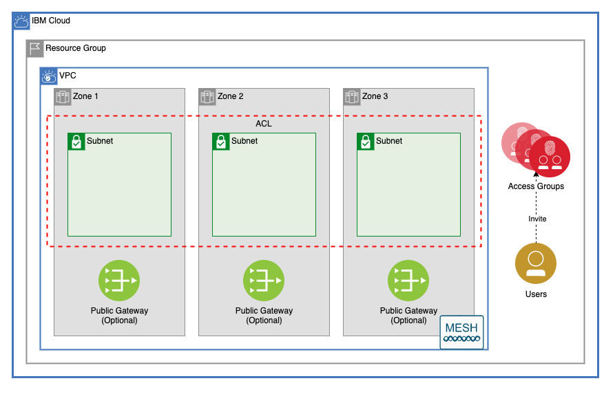

# GCAT Landing Zone

This module creates a resource group, a VPC in that resource group, IAM Access Groups, and invites users to those Access Groups.



---

## Table of Contents

1. [Access Groups](##access-groups)
2. [VPC](##vpc)
3. [Public Gateways](##public-gateways)
4. [Network ACL](##network-acl)
5. [Subnets](##subnets)
6. [Module Variables](##Module-Variables)
7. [Module Outputs](##Module-Outputs)
8. [As A Module in a Larger Architecture](##As-A-Module-in-a-Larger-Architecture)

---

## Access Groups

The [iam](./iam) module creates any number of access groups, with any number of policies.

The flexible `access_groups` variable allows users to dynamically create groups with complex rules using a single object.

### Invite Users

Users can be invited to these groups. Users invited to these access groups will be added to the access group even if they have not yet accepted the invite to the account. (If you do not need to invite users, delete [./iam/invite_users.tf](./iam/invite_users.tf) and remove `invite_users` fom the `access_group` variable definition.)

### Varable Type

```hcl
    list(
        object({
            name        = string # Name of the group
            description = string # Description of group
            policies    = list(
                object({
                    name      = string       # Name of the policy
                    roles     = list(string) # list of roles for the policy
                    resources = object({
                        resource_group       = optional(string) # Name of the resource group the policy will apply to
                        resource_type        = optional(string) # Name of the resource type for the policy ex. "resource-group"
                        service              = optional(string) # Name of the service type for the policy ex. "cloud-object-storage"
                        resource_instance_id = optional(string) # ID of a service instance to give permissions
                    })
                })
            )
            dynamic_policies = optional(
                list(
                    object({
                        name              = string # Dynamic group name
                        identity_provider = string # URI for identity provider
                        expiration        = number # How many hours authenticated users can work before refresh
                        conditions        = object({
                                claim    = string # key value to evaluate the condition against.
                                operator = string # The operation to perform on the claim. Supported values are EQUALS, EQUALS_IGNORE_CASE, IN, NOT_EQUALS_IGNORE_CASE, NOT_EQUALS, and CONTAINS.
                                value    = string # Value to be compared agains
                        })
                    })
                )
            )
            account_management_policies = optional(list(string)) # A list of group access management roles to create.
            invite_users                = list(string)           # Users to invite to the access group
        })
    )
```

---

## VPC

This module creates a VPC in a resource group with optional Classic Access. It also allows users to update the default vpc security group with additional rules.

### Default Security Group Rules

Default security group rules are converted from a list to an object to ensure that adding, deleting, or changing the order of rules listed will not force unwanted changes. Example:

```terraform
ibm_is_security_group_rule.default_vpc_rule["allow-inbound-ping"]
ibm_is_security_group_rule.default_vpc_rule["allow-inbound-ssh"]
```

---

## Public Gateways

This module allows a user to optionally create public gateways in the VPC in each of the three zones of the VPC's region.

---

## Network ACL

This module creates a network ACL with any number of rules. *(Note: by default, VPC Network ACLs have a maximum of 25 rules.)*
Any subnets created by this module will be connected to this ACL

## Subnets

The [subnet module](./subnet) allows users to create subnets in 1, 2, or 3 zones. Public gateways can be optionally attached to each subnet.

### Address Prefixes

A CIDR block is created in the VPC for each subnet that will be provisioned

### Subnets

The type of the `subnets` variable is as follows:

```terraform
object({
    zone-1 = list(object({
      name           = string
      cidr           = string
      public_gateway = optional(bool)
    }))
    zone-2 = list(object({
      name           = string
      cidr           = string
      public_gateway = optional(bool)
    }))
    zone-3 = list(object({
      name           = string
      cidr           = string
      public_gateway = optional(bool)
    }))
  })
```

While `zone-1`, `zone-2`, and `zone-3` are all lists, these lists are converted into an object before the resources are provisioned. This ensures that the addition or deletion of subnets will affect only the added or deleted subnets. Example:

```terraform
module.subnets.ibm_is_subnet.subnet["gcat-multizone-subnet-a"]
module.subnets.ibm_is_subnet.subnet["gcat-multizone-subnet-b"]
module.subnets.ibm_is_subnet.subnet["gcat-multizone-subnet-c"]
module.subnets.ibm_is_vpc_address_prefix.subnet_prefix["gcat-multizone-subnet-a"]
module.subnets.ibm_is_vpc_address_prefix.subnet_prefix["gcat-multizone-subnet-b"]
module.subnets.ibm_is_vpc_address_prefix.subnet_prefix["gcat-multizone-subnet-c"]
```

---

## Module Variables

Name                 | Type                                                                                                                                                                                                                                                                                                                                                                                                                                                                                                                                                             | Description                                                                         | Sensitive | Default
-------------------- | ---------------------------------------------------------------------------------------------------------------------------------------------------------------------------------------------------------------------------------------------------------------------------------------------------------------------------------------------------------------------------------------------------------------------------------------------------------------------------------------------------------------------------------------------------------------- | ----------------------------------------------------------------------------------- | --------- | ----------------------------------------------------------------------------------------------------------------------------------------------------------------------------------------------------------------------------------------------------------------------------------------------------------------------------------------------------------------------------------------------------------------------------------------------------------------------------------------------------------------------------------------------------------------------------------------------
ibmcloud_api_key     | string                                                                                                                                                                                                                                                                                                                                                                                                                                                                                                                                                           | The IBM Cloud platform API key needed to deploy IAM enabled resources               | true      | 
TF_VERSION           |                                                                                                                                                                                                                                                                                                                                                                                                                                                                                                                                                                  | The version of the Terraform engine that's used in the Schematics workspace.        |           | 1.0
prefix               | string                                                                                                                                                                                                                                                                                                                                                                                                                                                                                                                                                           | A unique identifier need to provision resources. Must begin with a letter           |           | gcat-multizone
region               | string                                                                                                                                                                                                                                                                                                                                                                                                                                                                                                                                                           | Region where VPC will be created                                                    |           | us-south
resource_group       | string                                                                                                                                                                                                                                                                                                                                                                                                                                                                                                                                                           | Name of resource group where all infrastructure will be provisioned                 |           | gcat-landing-zone-dev
classic_access       | bool                                                                                                                                                                                                                                                                                                                                                                                                                                                                                                                                                             | Enable VPC Classic Access. Note: only one VPC per region can have classic access    |           | false
subnets              | object({ zone-1 = list(object({ name = string cidr = string public_gateway = optional(bool) })) zone-2 = list(object({ name = string cidr = string public_gateway = optional(bool) })) zone-3 = list(object({ name = string cidr = string public_gateway = optional(bool) })) })                                                                                                                                                                                                                                                                                 | List of subnets for the vpc. For each item in each array, a subnet will be created. |           | {<br>zone-1 = [<br>{<br>name = "subnet-a"<br>cidr = "10.10.10.0/24"<br>public_gateway = true<br>}<br>],<br>zone-2 = [<br>{<br>name = "subnet-b"<br>cidr = "10.20.10.0/24"<br>public_gateway = true<br>}<br>],<br>zone-3 = [<br>{<br>name = "subnet-c"<br>cidr = "10.30.10.0/24"<br>public_gateway = true<br>}<br>]<br>}
use_public_gateways  | object({ zone-1 = optional(bool) zone-2 = optional(bool) zone-3 = optional(bool) })                                                                                                                                                                                                                                                                                                                                                                                                                                                                              | Create a public gateway in any of the three zones with `true`.                      |           | {<br>zone-1 = true<br>zone-2 = true<br>zone-3 = true<br>}
acl_rules            | list( object({ name = string action = string destination = string direction = string source = string tcp = optional( object({ port_max = optional(number) port_min = optional(number) source_port_max = optional(number) source_port_min = optional(number) }) ) udp = optional( object({ port_max = optional(number) port_min = optional(number) source_port_max = optional(number) source_port_min = optional(number) }) ) icmp = optional( object({ type = optional(number) code = optional(number) }) ) }) )                                                 | Access control list rule set                                                        |           | [<br>{<br>name = "allow-all-inbound"<br>action = "allow"<br>direction = "inbound"<br>destination = "0.0.0.0/0"<br>source = "0.0.0.0/0"<br>},<br>{<br>name = "allow-all-outbound"<br>action = "allow"<br>direction = "outbound"<br>destination = "0.0.0.0/0"<br>source = "0.0.0.0/0"<br>}<br>]
security_group_rules | list( object({ name = string direction = string remote = string tcp = optional( object({ port_max = optional(number) port_min = optional(number) }) ) udp = optional( object({ port_max = optional(number) port_min = optional(number) }) ) icmp = optional( object({ type = optional(number) code = optional(number) }) ) }) )                                                                                                                                                                                                                                  | A list of security group rules to be added to the default vpc security group        |           | [<br>{<br>name = "allow-inbound-ping"<br>direction = "inbound"<br>remote = "0.0.0.0/0"<br>icmp = {<br>type = 8<br>}<br>},<br>{<br>name = "allow-inbound-ssh"<br>direction = "inbound"<br>remote = "0.0.0.0/0"<br>tcp = {<br>port_min = 22<br>port_max = 22<br>}<br>},<br>]
access_groups        | list( object({ name = string description = string policies = list( object({ name = string roles = list(string) resources = object({ resource_group = optional(string) resource_type = optional(string) service = optional(string) resource_instance_id = optional(string) }) }) ) dynamic_policies = optional( list( object({ name = string identity_provider = string expiration = number conditions = object({ claim = string operator = string value = string }) }) ) ) account_management_policies = optional(list(string)) invite_users = list(string) }) ) | A list of access groups to create                                                   |           | [<br>{<br>name = "admin"<br>description = "An<br>example admin group" policies = [<br>{<br>name = "admin_all"<br>resources = {<br>resource_group = "gcat-landing-zone-dev"<br>}<br>roles = ["Administrator","Manager"]<br>}<br>]<br>dynamic_policies = []<br>invite_users = [<br>"test@test.test"<br>]<br>},<br>{<br>name = "dev"<br>description = "A<br>developer access group" policies = [<br>{<br>name = "dev_view_vpc"<br>resources = {<br>resource_group = "gcat-landing-zone-dev"<br>service = "id"<br>}<br>roles = ["Viewer"]<br>}<br>]<br>invite_users = ["test@test.test"]<br>}<br>]

---

## Module Outputs

Name               | Description
------------------ | -----------------------------------------------------------
access_groups      | Access group information
vpc_id             | ID of VPC created
acl_id             | ID of ACL created for subnets
public_gateways    | Public gateways created
subnet_ids         | The IDs of the subnets
subnet_detail_list | A list of subnets containing names, CIDR blocks, and zones.
subnet_zone_list   | A list containing subnet IDs and subnet zones

---

## As A Module in a Larger Architecture

```terraform
module landing_zone {
  source               = "./landing_zone"
  ibmcloud_api_key     = var.ibmcloud_api_key
  TF_VERSION           = var.TF_VERSION
  prefix               = var.prefix
  region               = var.region
  resource_group       = var.resource_group
  access_groups        = var.access_groups
  classic_access       = var.classic_access
  subnets              = var.subnets
  use_public_gateways  = var.use_public_gateways
  acl_rules            = var.acl_rules
  security_group_rules = var.security_group_rules
}
```
